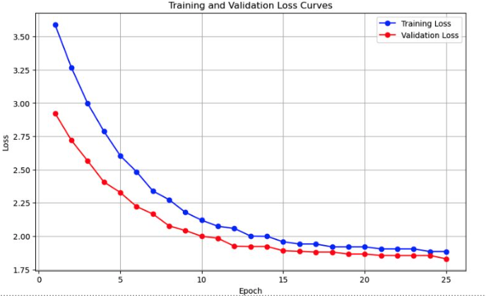

## Story Generation with NanoGPT

This project involves developing a nanoGPT language model from scratch to generate stories using the Tiny Stories dataset from Hugging Face. The nanoGPT architecture, a lightweight version inspired by the main GPT model, was used in this project and comprises 28 million parameters.

## Dataset

- **Dataset**: [Tiny Stories](https://huggingface.co/datasets/roneneldan/TinyStories)
- **Number of Stories**: 2.12M
- **Tokenizer Used**: GPT2 Tokenizer
- **Generating a Batch**: Selected 100 stories randomly. Added start and end token to distinguish stories and selected a window context length size tokens randomly.

## Training 
- Replicated the pretraining phase of LLM to generate a story. ​

- Trained a small language model of 28Million parameters ​

- Trained on predicting next token in the vocabulary of size 50k​

<table>
  <tr style="background-color: #0074D9; color: white;">
    <th style="font-weight: bold;">Size</th>
    <th style="font-weight: bold;">Layers</th>
    <th style="font-weight: bold;">Embedding Dimension</th>
    <th style="font-weight: bold;">Attention Heads</th>
    <th style="font-weight: bold;">Tokens Trained</th>
    <th style="font-weight: bold;">Context Length</th>
  </tr>
  <tr>
    <td>28M</td>
    <td>4</td>
    <td>256</td>
    <td>8</td>
    <td>1.2B</td>
    <td>512</td>
  </tr>
</table>

## Evaluation
Model: nanoGPT (28.02 Million parameters)

Training Loss: 2.0

Validation Loss: 1.88

## Output Snapshots 

## Potential Improvements 
If you can see in the output, stories are half meaningful. Due to resource constraints, I couldn't run the big model, but with proper resources, we can try running a bigger model to get more meaningful stories.

