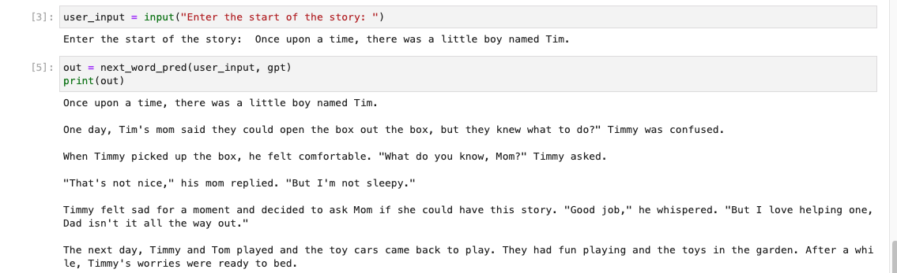

## Story Generation with NanoGPT

This project involves developing a nanoGPT language model from scratch to generate stories using the Tiny Stories dataset from Hugging Face. The nanoGPT architecture, a lightweight version inspired by the main GPT model, was used in this project and comprises 28 million parameters.

## Dataset
 Link - https://huggingface.co/datasets/roneneldan/TinyStories
 
 TinyStories is a curated collection of short stories, providing a rich and diverse set of examples for the model to learn from. This dataset contains 2.1 Million short stories.

## Model 
Model: nanoGPT (28.02 Million parameters)

Training Loss: 2.0

Validation Loss: 1.88

## Output Snapshots 

